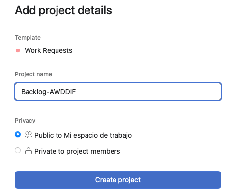

## Product Backlog en Asana

[Regresar](/CodingBootcampsESPOL-SCRUM/)

Para el producto backlog, considerar el [detalle de los sprint](./detalle-sprint.md), ya que todas esas actividades se agregaran en el proyecto creado en Jira.

+ Ingresar a tu cuenta en Asana, en el panel principal en la esquina superior derecha dar clic en el ícono que contiene el signo de más, luego seleccionar la opción de "Project".

+ Escogemos la opción de "use a template".

+ En el panel lateral izquierdo escoger la opción de "Work Requests", luego dar clic en "use template".

+ Dado que nuestro proyecto es una **A**plicación **W**eb **D**e **D**etección **D**e **I**ncendios **F**orestales, en base a las iniciales creamos un proyecto que representará el product Backlog y en el cuadro de texto se colocará el nombre del proyecto que es **Backlog-AWDDIF**. Luego damos click en el botón de Create project. 

+ La opción de "new request" no será utilizada por tal razón en el ícono de los tres puntos seguidos, dar clic y elegir la opción de "delete section".

+ En la sección de "Backlog" ingresamos todas las tareas descritas en el [detalle de los sprint](./detalle-sprint.md)

+ Una vez añadidas las tareas, nuestro backlog se visualizará de la siguiente manera.

Asignar responsable
===========

* * *
Para cada tarea dentro del product Backlog existe la opción de asignar un responsable.

+ Nos ubicamos en la columna de "Assigne", y damos click en la el cuadro de texto en la que escribiremos el correo electrónico del responsable de dicha tarea a realizar. Continuamos con el proceso de confirmación de invitar al usuario a unirse al proyecto.

+ La asignación de una tarea de backlog se visualiza de la siguiente manera.

