## Creación de cuenta en Asana

[Regresar](/CodingBootcampsESPOL-SCRUM/)

## Asana
 
Asana es una herramienta para ayudarte a planificar, organizar y gestionar el trabajo de tu equipo, de principio a fin. Un buen software de gestión de proyectos también actúa como herramienta de colaboración. Puedes coordinar las tareas del equipo para que todos sepan quién hace qué. Comparte comentarios, archivos y actualizaciones de estado. Además, obtén una vista completa del trabajo para que los equipos realicen las tareas correctas en el momento correcto.

## Creación de cuenta
 
+ Accede al sitio oficial de [Asana](https://asana.com/es/create-account) para realizar la creación de la cuenta.

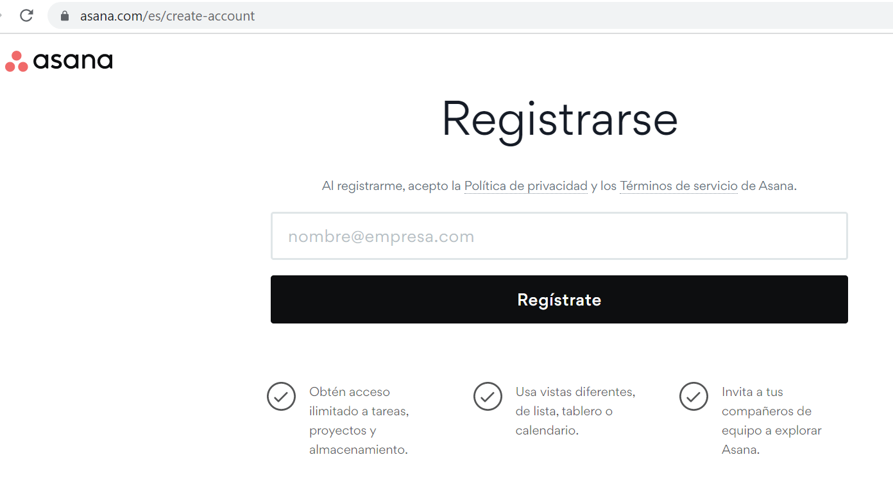

+ En el cuadro de texto debes colocar el correo electrónico con el que deseas registrarte, luego das clic en el botón "Regístrate". 

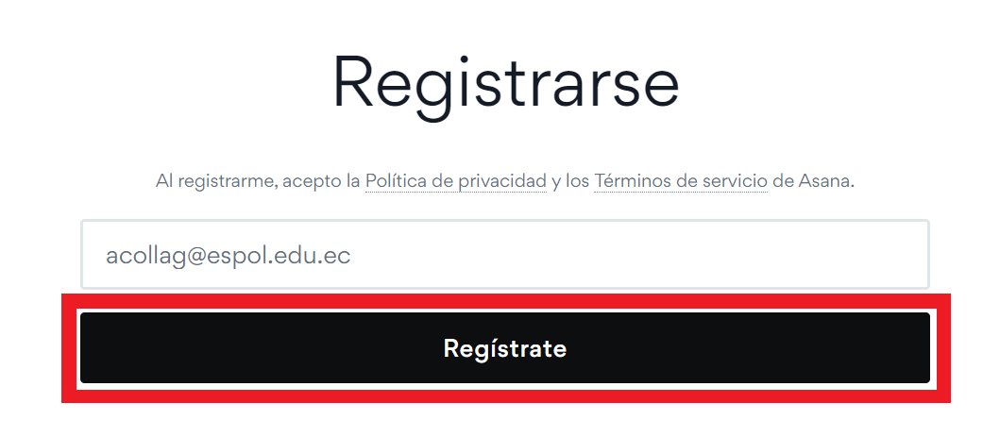

+ Luego se mostrará la Bienvenida a ASANA con su información personal, dar clic en Continuar.

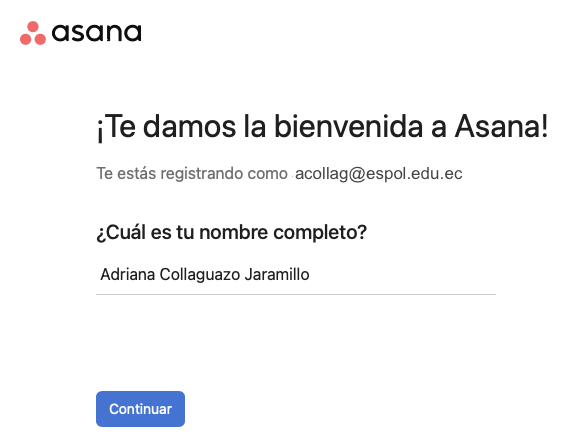

+ Seleccionar la función principal (cargo) en la gestión del proyecto, por ejemplo seleccionar Director, luego dar clic en Continuar.

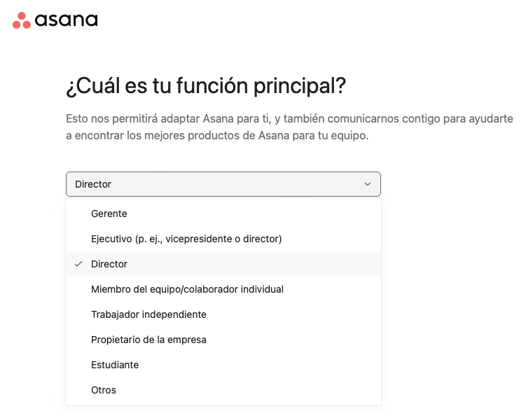

+ Elegir el tipo de trabajo que hace, por ejemplo Tecnología de la Información (TI), luego dar clic en Continuar.

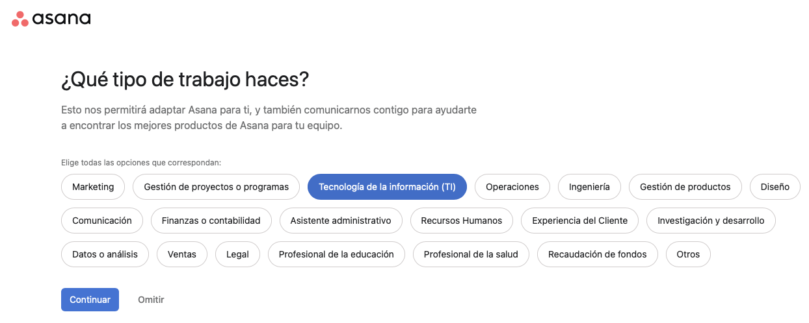

Escoger el principal objetivo de utilizar Asana, por ejemplo Gestión de proyectos y procesos, luego dar clic en Continuar.

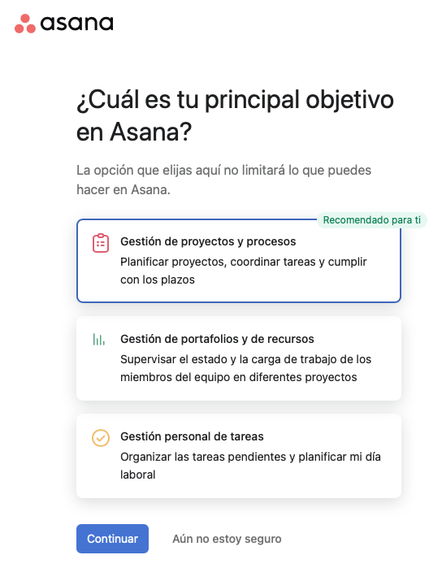

Lo siguiente es crear tu primer proyecto indicando un nombre del proyecto como **Backlog-AWDDIF**, luego dar clic en Continuar.

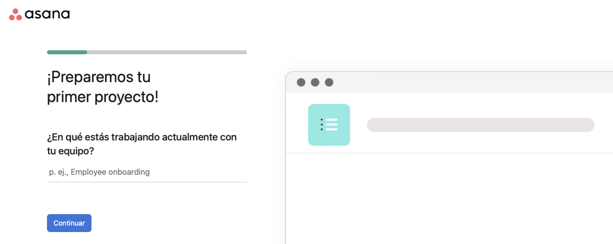

Añadir las tareas al Product Backlog, luego dar clic en Continuar.

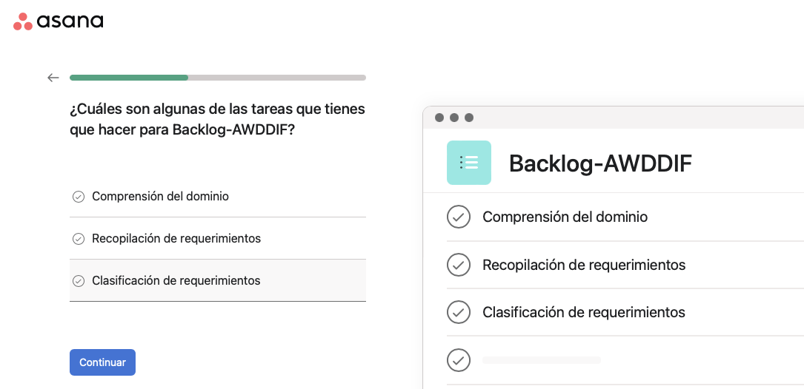

Agrupar las tareas en Etapas como Tareas pendientes, En curso, y Trabajo terminado, luego dar clic en Continuar.

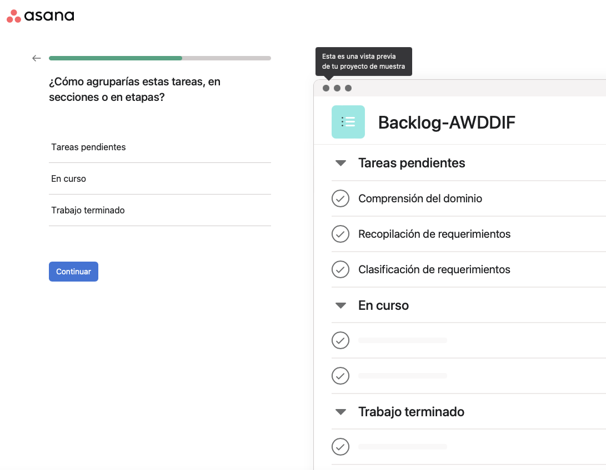

Escoger el diseño del tablero de tareas, luego dar clic en Continuar.

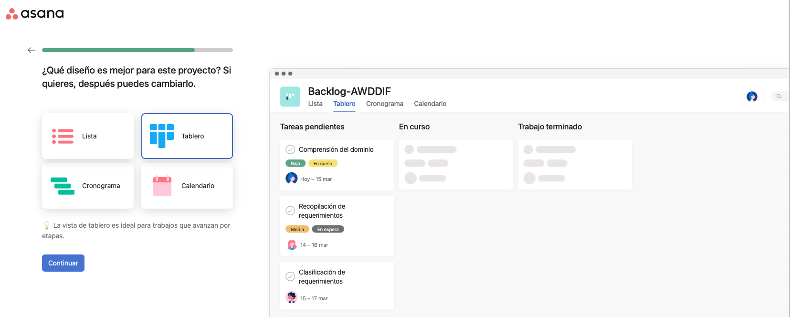

Agregar las cuentas de correo del Scrum Team, luego dar clic en Continuar.

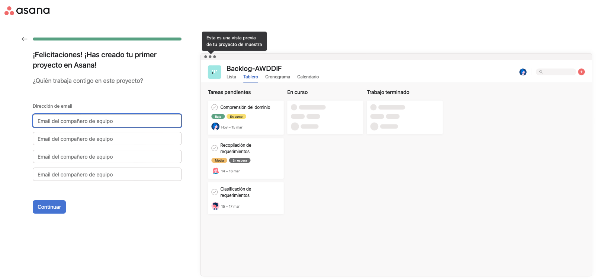

Finalmente, se muestra la página de inicio de tu cuenta en Asana.

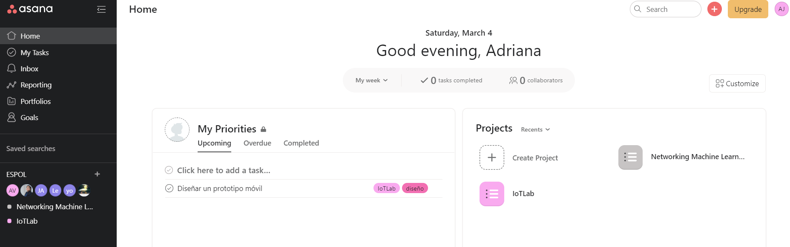

 Referencias 
===========

* * *

* Asana. Retrieved 4 March 2023, from [https://asana.com/es](https://asana.com/es)