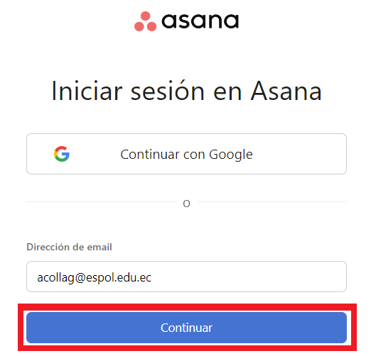
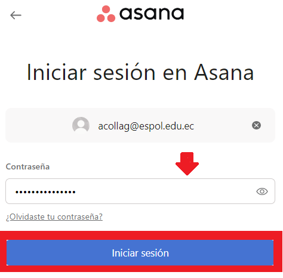

## Creación de cuenta en Asana

[Regresar](/CodingBootcampsESPOL-SCRUM/)

## Asana
 
Asana es una herramienta para ayudarte a planificar, organizar y gestionar el trabajo de tu equipo, de principio a fin. Un buen software de gestión de proyectos también actúa como herramienta de colaboración. Puedes coordinar las tareas del equipo para que todos sepan quién hace qué. Comparte comentarios, archivos y actualizaciones de estado. Además, obtén una vista completa del trabajo para que los equipos realicen las tareas correctas en el momento correcto.

## Creación de cuenta
 
+ Accede al sitio oficial de [Asana](https://asana.com/es/create-account) para realizar la creación de la cuenta.

+ En el cuadro de texto debes colocar el correo electrónico con el que deseas registrarte, luego das clic en el botón "Registrate". 

+ De ahí se te redirigirá a la ventana de login, donde deberas colocar el correo electrónico con el que te registrarte y de ahí dar clic en el botón de "continuar".

+ Ahora en el cuadro de texto de la contraseña colocarás la correspondiente a la del correo electrónico y de ahí dar clic en el botón de "Iniciar sesión". 

+ De ahí se te redirigirá a la página de inicio de tu cuenta en asana.

 Referencias 
===========

* * *

* Asana. Retrieved 4 March 2023, from [https://asana.com/es](https://asana.com/es)