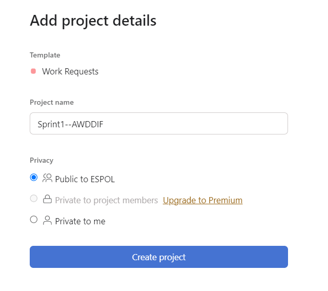
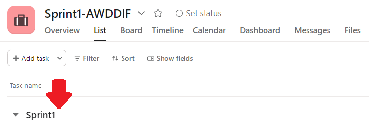
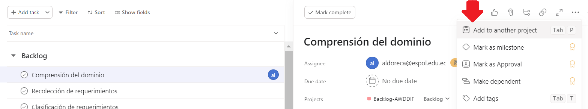
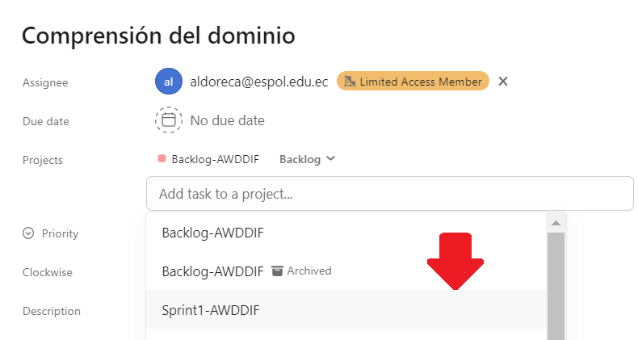
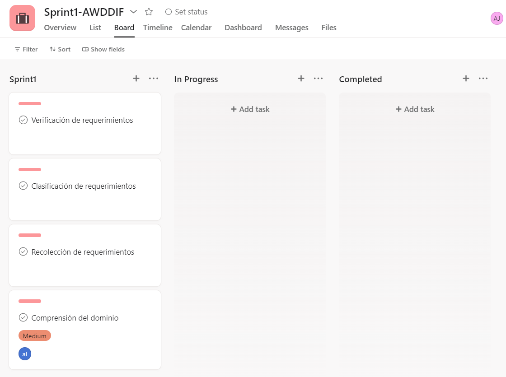

## Creación de sprint en Asana 

Para realizar la gestión de los sprint, se deberá crear un nuevo proyecto para cada Sprint. 

+ Nos ubicamos en el home de la cuenta en Asana. Creamos un nuevo proyecto con el nombre de "Sprint1-AWDDIF", usando el template de "work requests". 

+ Editamos la primera sección añadiendole el nombre de "Sprint1".

Ahora, regresamos al [proyecto de Backlog](./backlog-asana.md) que creamos anteriormente, nos ubicamos en la sección "List" del Backlog-AWDDIF. 

+ Seleccionamos una de las tareas correspondientes al Sprint 1 que ya estaban definidas en el [detalle de los sprints](./detalle-sprint.md). Ya seleccionada, en el icono de los tres puntos seguidos escoger la opción de "Add to another project". 

 
 + Asociaremos la tarea al proyecto de "Sprint1-AWDDIF".

El proceso se asociar cada tarea al proyecto de "Sprint1-AWDDIF" dependerá de las tareas del Backlog que corresponda al Sprint 1. 

+ Nos dirigimos la tablero de "Sprint1-AWDDIF" y visualizamos que efectivamente se han añadido las tareas a dicho proyecto. Además, se las puede ir colocando dependiendo del progreso de la tarea. 

