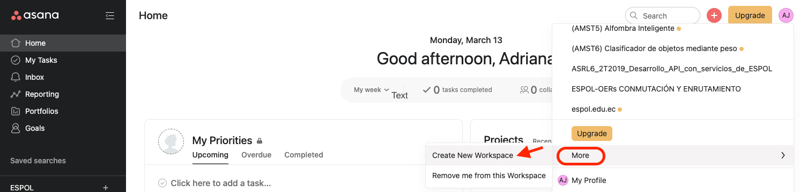
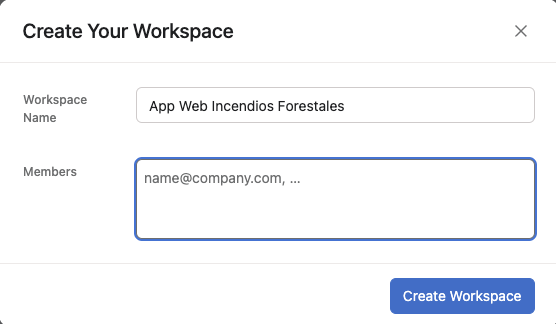
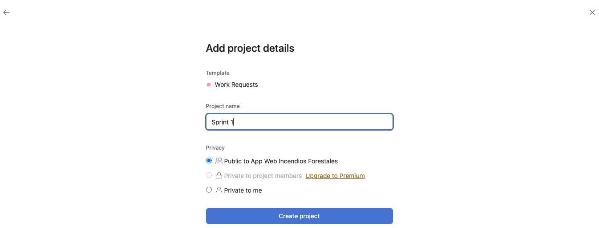
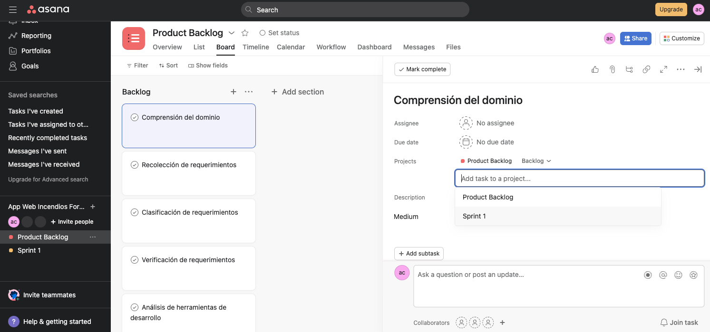
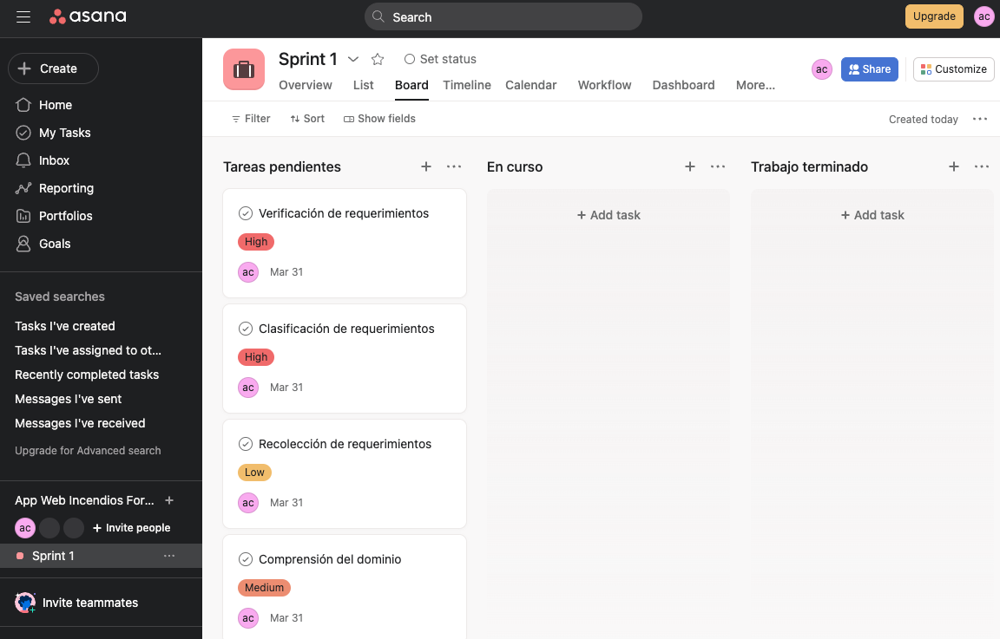

## Creación de sprint en Asana 

Para realizar la gestión de los sprint, se deberá crear un nuevo proyecto para cada Sprint. 

+ Nos ubicamos en el Home de la cuenta en Asana. 

+ Crearemos un WorkSpace para organizar de mejor manera nuestros Sprints.

+ Primero damos clic en la esquina superior derecha donde se encuentra el icono del perfil de usuario.

+ Segundo seleccionar la opción More, y luego Create New WorkSpace.

+ Colocamos el nombre del WorkSpace como **App Web Incendios Forestales**.

+ Ahora si, creamos un nuevo proyecto con el nombre de **Sprint 1** dentro del WorkSpace App Web Incendios Forestales. Es opcional, seleccionar la plantilla de Work requests. 

Ahora, regresamos al [proyecto de Backlog](./backlog-asana.md) que creamos anteriormente, nos ubicamos en la sección "List" del Backlog-AWDDIF.

+ Seleccionamos una de las tareas correspondientes al Sprint 1 que ya estaban definidas en el [detalle de los sprints](./detalle-sprint.md). Una vez seleccionada, en el icono de los tres puntos seguidos escoger la opción de "Add to another project". 

 
 + Asociaremos la tarea al proyecto de "Sprint 1".

+ El proceso se asociar cada tarea al proyecto de **Sprint 1** dependerá de las tareas del Backlog que corresponda al Sprint 1.

+ Nos dirigimos al tablero de **Sprint 1** para visualizar las tareas en el primer avance.

