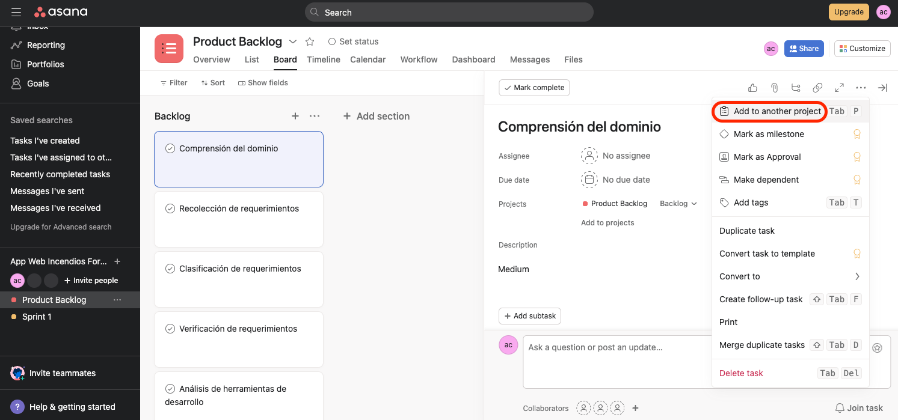

## Creación de sprint en Asana 

Para organizar de mejor manera las tareas de cada Sprints, les presentaré una segunda opción de creación de un proyecto dentro de un espacio de trabajo:

+ Primero nos dirijimos al Home de la cuenta en Asana. 

+ Segundo creamos un WorkSpace, dando clic en la esquina superior derecha donde se encuentra el icono del perfil de usuario.

+ Seleccionar la opción More, y luego Create New WorkSpace.

+ Colocamos el nombre del WorkSpace como **App Web Incendios Forestales**.

+ Ahora si, creamos un nuevo proyecto con el nombre de **Sprint 1** dentro del WorkSpace App Web Incendios Forestales. Es opcional, seleccionar la plantilla de Work requests. 

* En este punto, revisamos el [proyecto de Backlog](./backlog-asana.md) que creamos anteriormente, nos ubicamos en la sección "Board" del **Product Backlog**.

+ Seleccionamos una de las tareas correspondientes al Sprint 1 previamente definidas en el [detalle de los sprints](./detalle-sprint.md). Una vez seleccionada, en el icono de los tres puntos seguidos escoger la opción de "Add to another project". 

 
 + Asociaremos la tarea al proyecto de "Sprint 1".

+ Finalmente, nos dirigimos al tablero de **Sprint 1** para visualizar las tareas en el primer avance.

