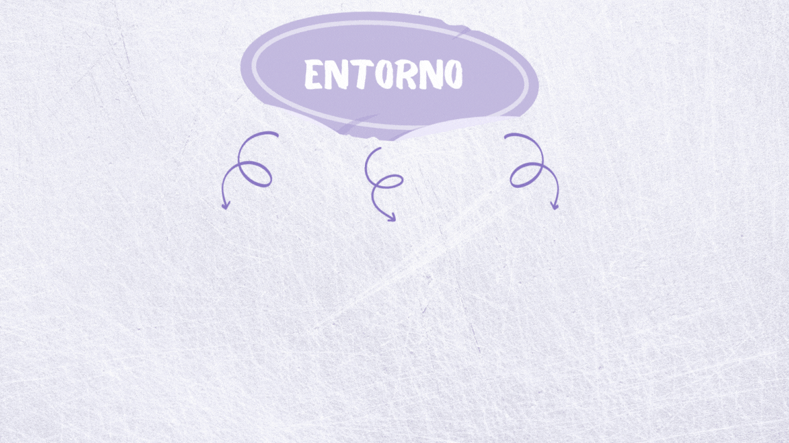

[Regresar](/CodingBootcampsESPOL-SCRUM/)

# Definición de Scrum

Scrum es un marco de trabajo liviano que ayuda a las personas, equipos y organizaciones a generar valor
a través de soluciones adaptativas para problemas complejos.
El póster de Scrum Framework proporciona una vista gráfica de cómo se implementa Scrum a nivel de equipo dentro de una organización. El Framework se basa en [The Scrum Guide](https://scrumguides.org/), que los co-creadores de Scrum, Ken Schwaber y Jeff Sutherland, escribieron para explicar Scrum de manera clara y sucinta.

En pocas palabras, Scrum requiere un Scrum Master para fomentar  el siguiente entorno:

Scrum es simple. Pruébelo como está y determine si su filosofía, teoría y estructura ayudan a lograr
objetivos y crear valor. El marco de trabajo Scrum es incompleto de manera intencional, solo define las
partes necesarias para implementar la teoría de Scrum. Scrum se basa en la inteligencia colectiva de las
personas que lo utilizan. En lugar de proporcionar a las personas instrucciones detalladas, las reglas de
Scrum guían sus relaciones e interacciones.
En este marco de trabajo pueden emplearse varios procesos, técnicas y métodos. Scrum envuelve las
prácticas existentes o las hace innecesarias. Scrum hace visible la eficacia relativa de las técnicas
actuales de gestión, entorno y trabajo, de modo que se puedan realizar mejoras.

Referencias 
===========

* * *

* The Scrum Framework Poster. Retrieved 26 February 2023, from https://www.scrum.org/resources/scrum-framework-poster 
* Scrum Guides. Retrieved 26 February 2023, from https://scrumguides.org/