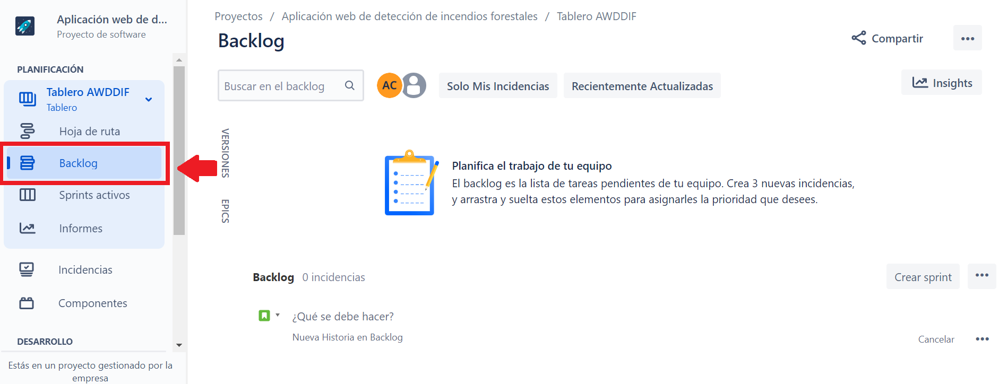
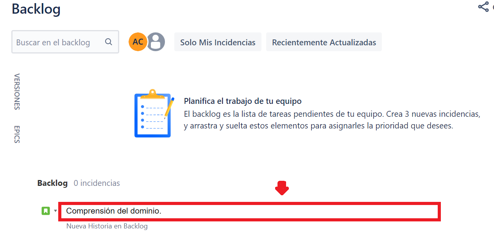
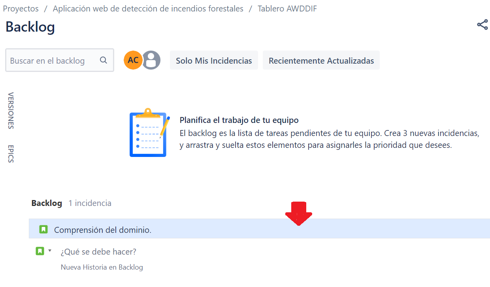
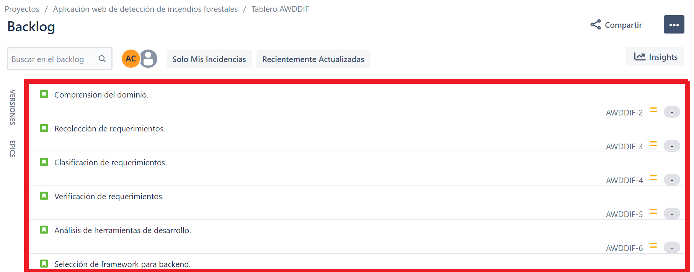

## Product backlog

[Regresar](/CodingBootcampsESPOL-SCRUM/)

Para continuar con la creación del proyecto en Scrum en Jira, se  debe tener como base la [creación del proyecto](./primer-proyecto.md) descrita en el tutorial anterior. Ahora es momento de crear el [product backlog](../product-baclog.md). 

Para el producto backlog, considerar el [detalle de los sprint](./detalle-sprint.md), ya que todas esas actividades se agregaran en el proyecto creado en Jira.

+ Ingresar al proyecto "Aplicación web de detección de incendios forestales", de ahí en el panel izquierdo elegir la opción de "Baclog".

+ Cada una de las actividades descritas en el [detalle de los sprint](./detalle-sprint.md) se agregarán en el backlog, por esa razón dentro del panel se identificará un cuadro de texto en la que ahí escribirás dichas actividades, las escribes una por una dando enter y se guardan automáticamente. 

+ Una actividad del backlog se visualizará de la siguiente manera:

+ Ya agregadas todas las actividades, el backlog se visualizará de la siguiente manera:

