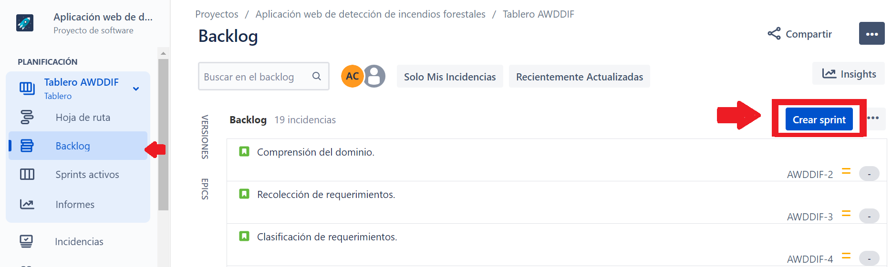
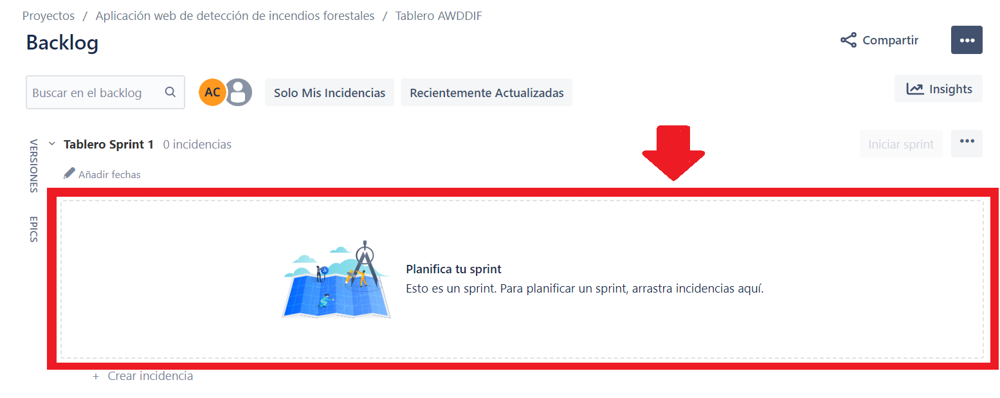
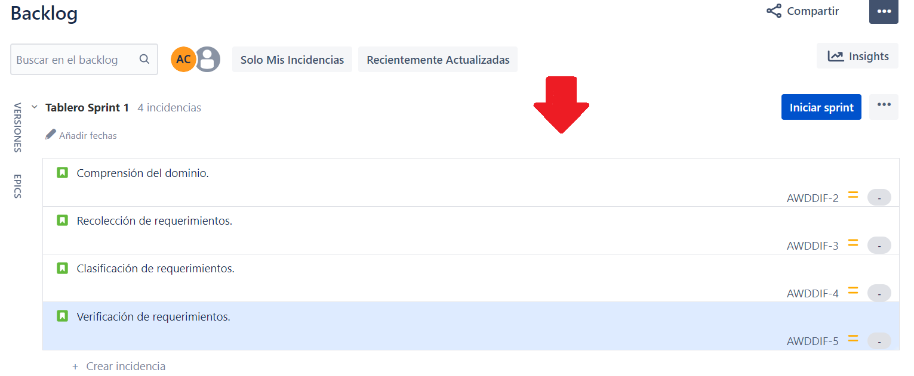
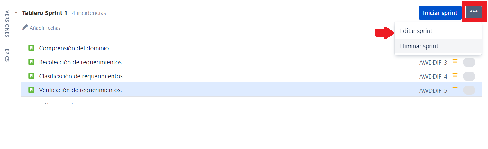
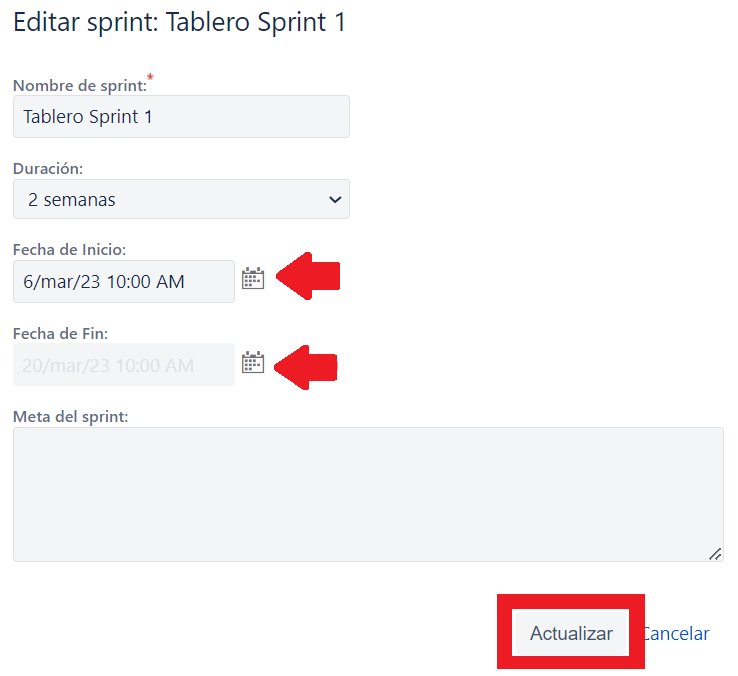
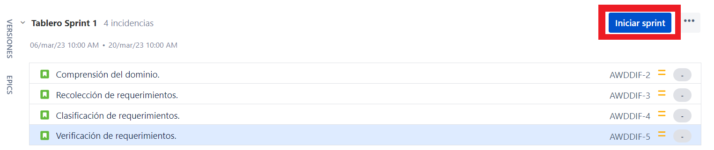
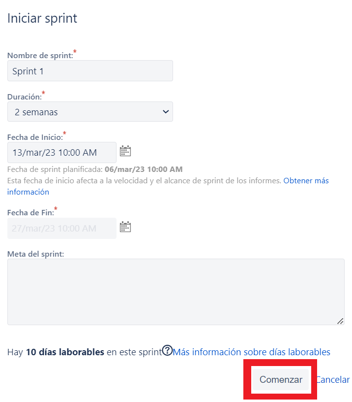
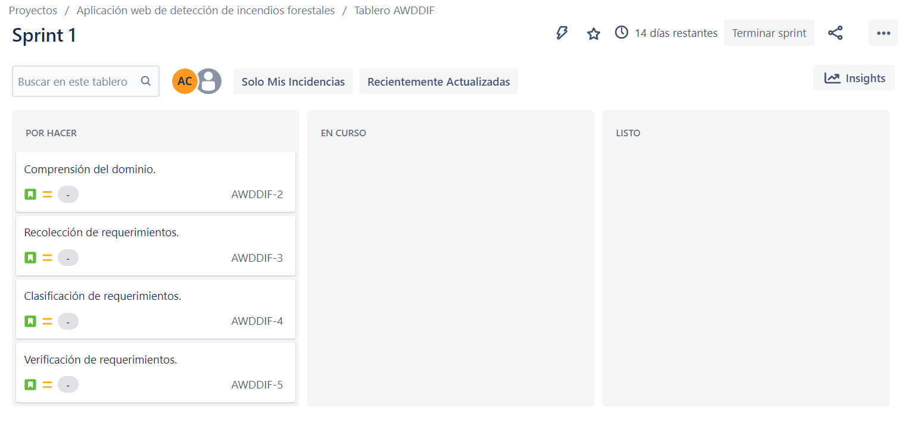

# Creación de Sprint en Jira

El desglose de las actividades que incluye cada sprint están definidas en el [tutorial de detalles de Sprint](./detalle-sprint.md). Teniendo como referencia dicha información, iniciaremos con el proceso de creación de Sprint en Jira.

+ Abrimos el proyecto en Jira, nos ubicamos en el Backlog y de ahí visualizamos las tareas que agregamos. En la parte superior derecha, se encontrará el botón de "Crear sprint" y le daremos clic. 

+ Ahí nos indica que dentro del cuadro, debemos arrastrar las actividades del Backlog que se realizarán dentro de dicho sprint. 

+ En base al [detalle de los Sprints](./detalle-sprint.md), añadimos las actividades correspondientes al primer Sprint.

Asignar responsable
===========

* * *
Para cada tarea dentro del Sprint existe la opción de asignar un responsable.

+ Para asignar un responsable, dar click a una de las actividades y saldrá un panel lateral derecho, en la que se encontrará la opción de asignar un responsable. 

Duración del Sprint
===========

* * *

Recordemos que cada Sprint tiene un periodo de tiempo asignado que se encuentra descrito en el [detalle de los Sprints](./detalle-sprint.md). 

+  Para asignarle el tiempo, dentro del mismo tablero del Sprint en la parte superior derecha se encuentra el icono de tres puntos seguidos, al cual seleccionados y elegimos la opción de "editar sprint".

+ En la nueva ventana aparecerá la opción para editar y asignar las fechas de inicio y fin, una vez actualizadas damos click en el botón de "actualizar". 

Iniciar un Sprint
===========

* * *

+ Ya definido el Sprint, el siguiente paso es iniciarlo. Por esa razón, dentro del panel del Sprint 1 se visuliza el botón de "Iniciar Sprint" en donde se dara click para iniciar. 

+ De ahi nos mostrará la información que se habia configurado anteriormente, corrobamos la información. Luego, dar click en el botón de "Comenzar".

+ Ahora nos aparecerá las actividades dentro del panel de sprint activos, en la que se irá actualizando en base al cumplimiento de dichas tareas planificadas para dicho Sprint.

