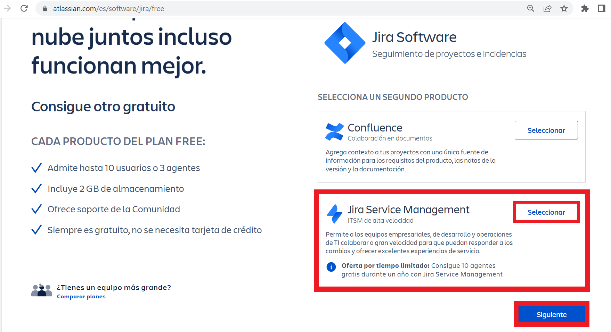

[Regresar](/CodingBootcampsESPOL-SCRUM/)
## Creación de cuenta en Jira

## Jira
 
 Jira es una aplicación web que con el tiempo se ha convertido en el estándar del mercado en las áreas de gestión de proyectos, gestión de tareas y gestión de errores. Especialmente para el desarrollo de software, Jira es una excelente herramienta que puede facilitar significativamente los pasos de trabajo y la cooperación tanto de equipos pequeños como grandes. El software fue desarrollado por la empresa australiana Atlassian y está en el mercado desde 2002.

## Creación de cuenta
 
+ Accede al sitio oficial de [Jira](https://www.atlassian.com/es/software/jira/free), en donde seleccionarás la opcion de Jira Service Managment y luego das clic en el botón de siguiente.

 Referencias 
===========

* * *

* ¿Qué es Jira?. Retrieved 2 March 2023, from [https://www.ionos.es/digitalguide/paginas-web/desarrollo-web/que-es-jira/](https://www.ionos.es/digitalguide/paginas-web/desarrollo-web/que-es-jira/)