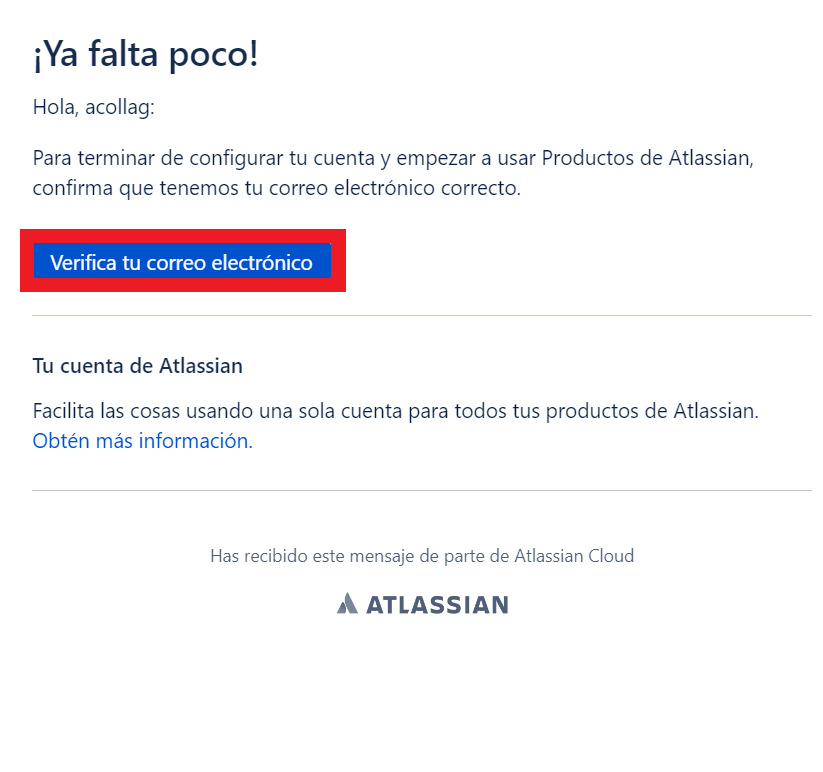
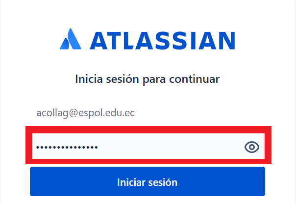

## Creación de cuenta en Jira

[Regresar](/CodingBootcampsESPOL-SCRUM/)

## Jira
 
 Jira es una aplicación web que con el tiempo se ha convertido en el estándar del mercado en las áreas de gestión de proyectos, gestión de tareas y gestión de errores. Especialmente para el desarrollo de software, Jira es una excelente herramienta que puede facilitar significativamente los pasos de trabajo y la cooperación tanto de equipos pequeños como grandes. El software fue desarrollado por la empresa australiana Atlassian y está en el mercado desde 2002.

## Creación de cuenta
 
+ Accede al sitio oficial de [Jira](https://www.atlassian.com/es/software/jira/free), en donde seleccionarás la opcion de Jira Service Managment y luego das clic en el botón de siguiente.

+ Te redirigirás a un nuevo enlace, en la que debes colocar tu correo para la creación de la cuenta, y de ahí dar clic en el botón aceptar.

+ Tendrás que continuar con el proceso de verificación de la cuenta en el correo personal. 

 
+ En el mensaje de confirmación que fue enviado a tu correo, debes dar clic a "verifica tu correo electronico".

+ Una vez realizado el paso anterior, te redirigirá a una nueva ventana en la que debes colocar la contraseña correspondiente a tu correo electrónico. Luego das clic en iniciar sesión.

+ Finalmente, tu cuenta fue creada y ahora podrás empezar a crear tu proyecto en Jira.

 Referencias 
===========

* * *

* ¿Qué es Jira?. Retrieved 2 March 2023, from [https://www.ionos.es/digitalguide/paginas-web/desarrollo-web/que-es-jira/](https://www.ionos.es/digitalguide/paginas-web/desarrollo-web/que-es-jira/)