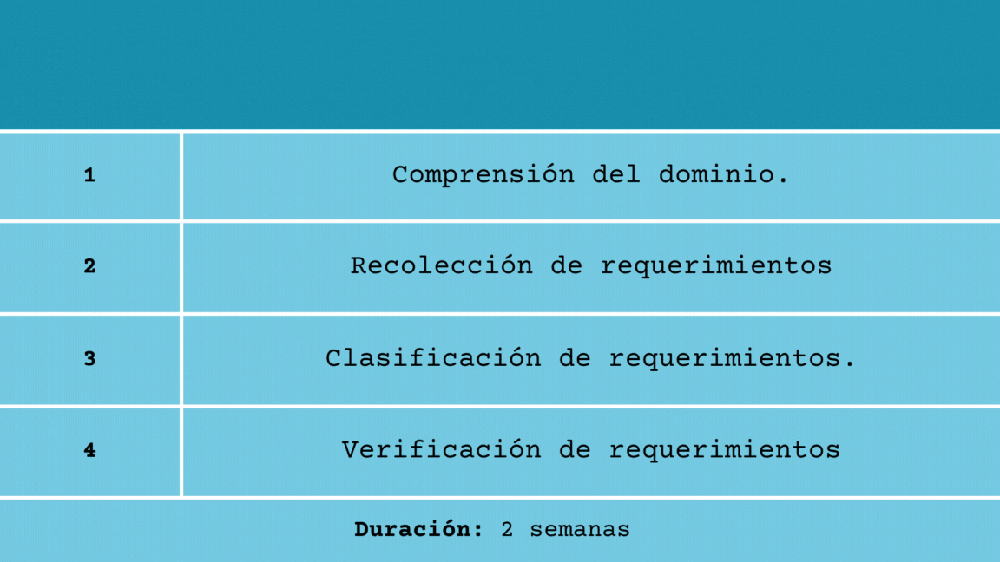
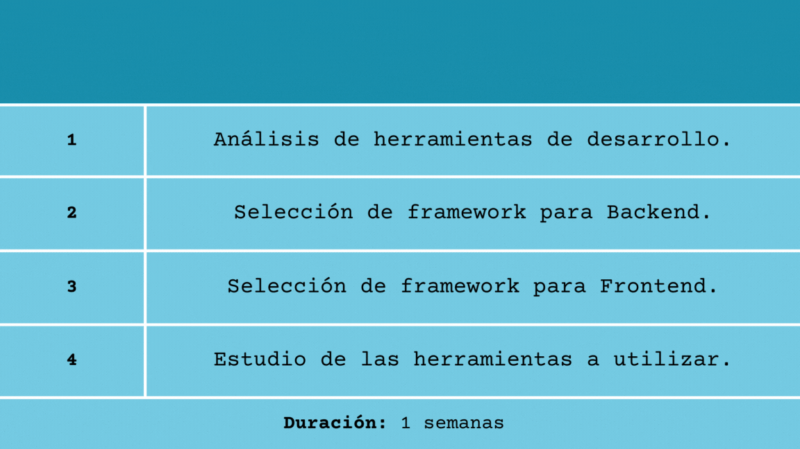
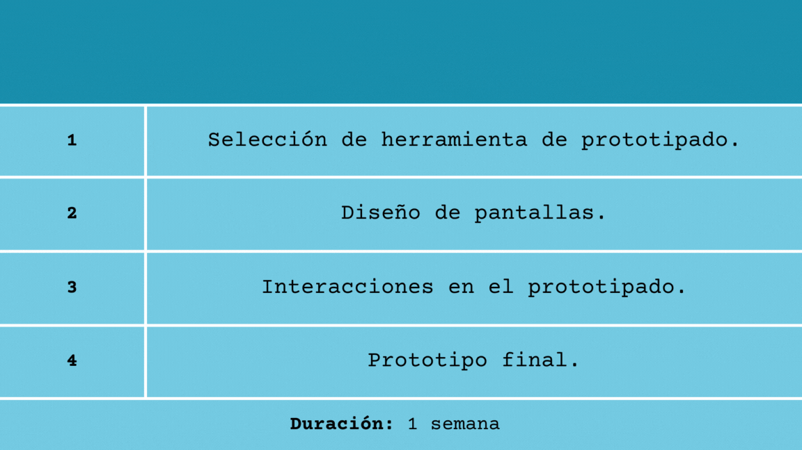
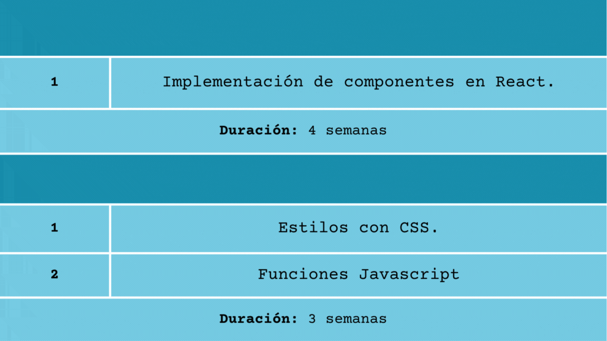
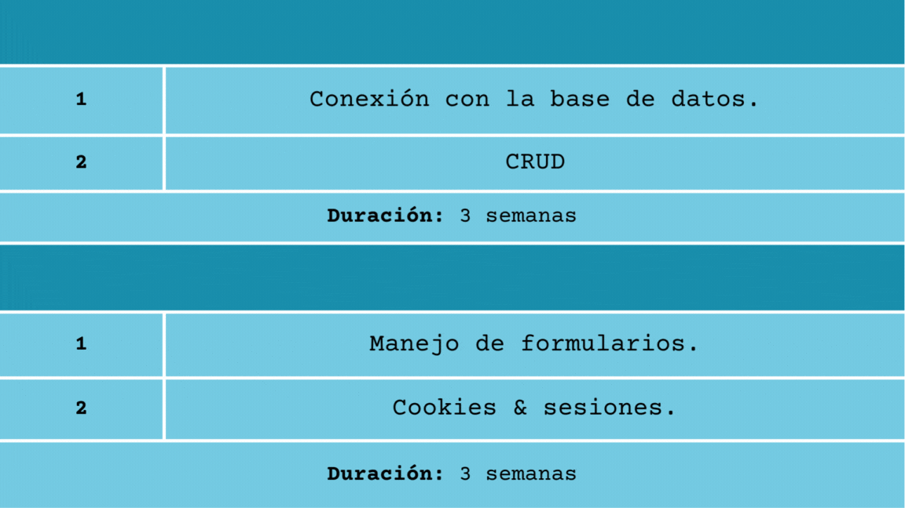

# Detalle de las actividades de los Sprint

Debemos tener en cuenta cuáles son el desglose de actividades por sprint necesarias para la creación de la página web de detección de incendios forestales. A continuación se detallan las actividades para cada sprint.

Sprint 1
===========

* * *

Sprint 2
===========

* * *

Sprint 3
===========

* * *

Sprint 4 - 5
===========

* * *

Sprint 6-7
===========

* * *

