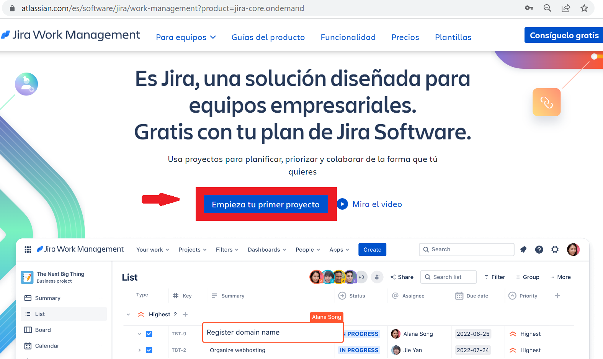
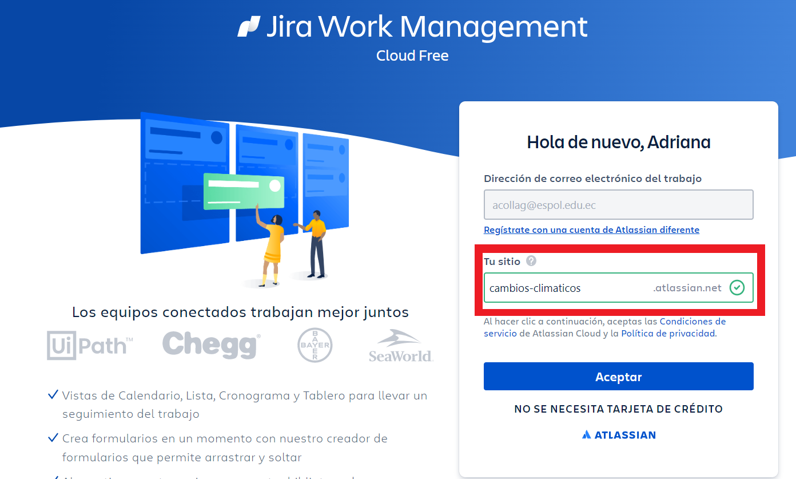
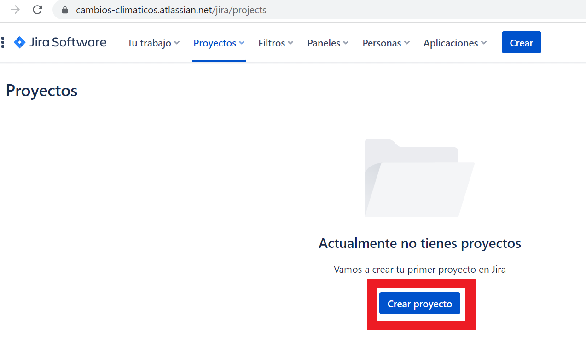
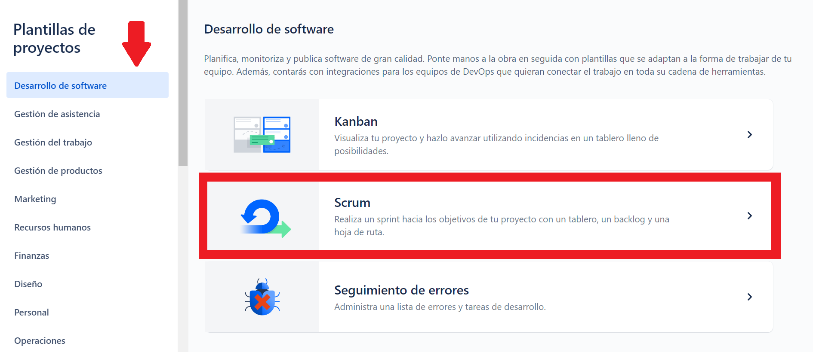
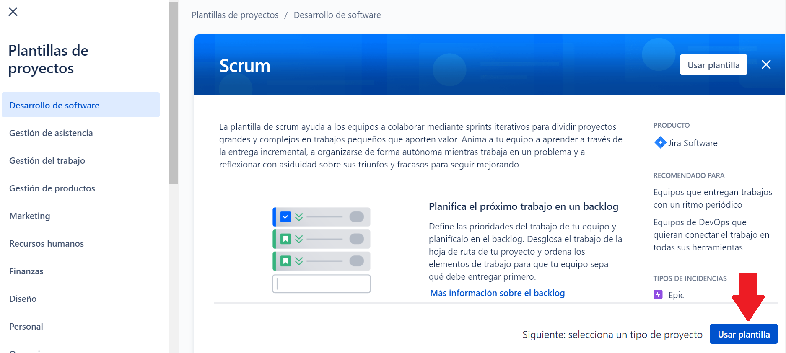
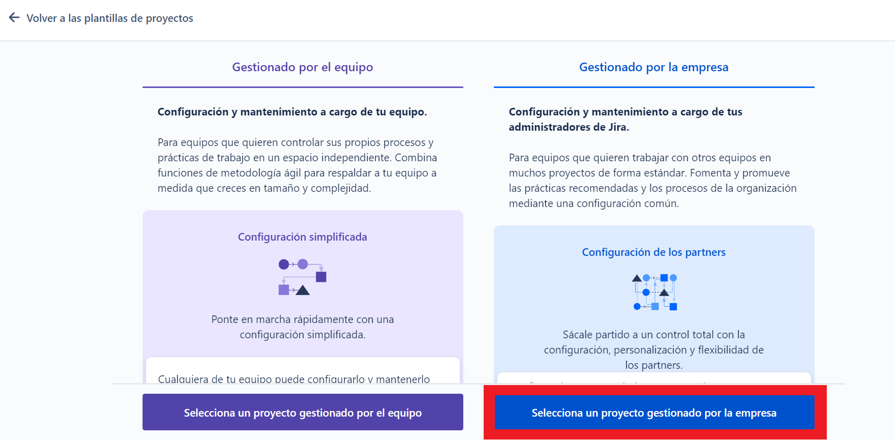
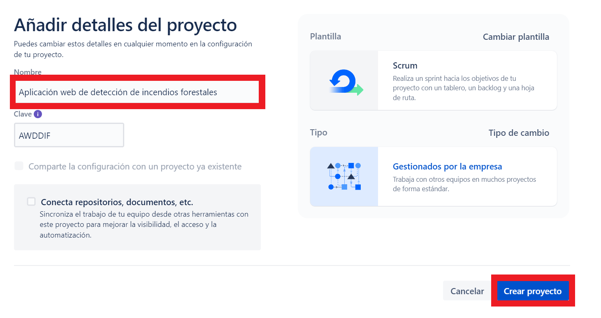
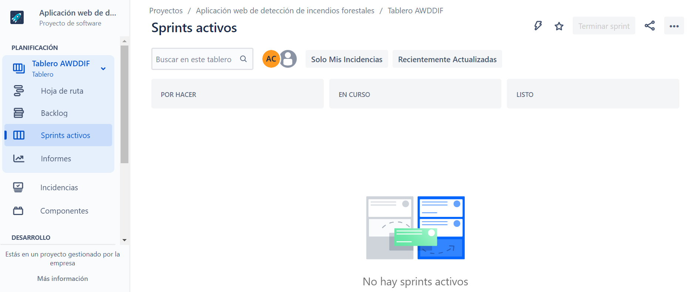

## Primer proyecto en Jira

[Regresar](/CodingBootcampsESPOL-SCRUM/)

## Configuración del proyecto

+ Es momento de iniciar creando nuestro primer proyecto en Jira, asi que una vez creada tu cuenta siguiendo los pasos anteriores de [crear cuenta](/tutoriales/jira/creacion-cuenta.md). En el panel principal da clic en "Empieza tu primer proyecto".

+ El paso anterior mostrará una nueva página en donde debes colocar el nombre del sitio. Con fines educativos, se trabajará con la gestión de un proyecto de aplicación web sobre cambios climáticos, de forma especifica una aplicación web sobre la detección de incendios forestales. Por esa razón, en el cuadro de texto colocamos el nombre de "cambio-climático". Se debe tener en cuenta que debe estra disponible el nombre del sitio, y de ahí damos clic en el botón de aceptar. 

+ Se inicia con un proceso de espera mientras se configura el sitio que estamos creando.

+ Una vez creado el sitio, dirigite al panel principal en la [sección de proyectos](https://cambios-climaticos.atlassian.net/jira/projects). De ahí elige da clic en el botón de crear Proyecto.

+ Ahora en te aparecerá una ventana en la que eliges en el panel izquierdo la categoría "Desarrollo de software", y una vez que te encuentres ahí eliges la opción de Scrum.

+ Como seleccionamos la plantilla Scrum, nos pedirá si deseamos utilizar esa plantilla, asi que en la parte inferior se encontrará el botón de "Usar plantilla" y daremos clic.

+ Ahora se elige el tipo de proyecto, y se escogerá la opción de "Gestionado por la empresa". 

+ Ahora configuraremos el proyecto dandole un nombre en este caso será "Aplicación web de detección de incendios forestales". Luego dar clic en "crear proyecto".

+ Finalmente, el proyecto fue creado y está listo para ser configurado utilizando la metodología de Scrum.

Referencias 
===========

* * *

* Aprende Scrum con Jira Software. Retrieved 2 March 2023, from [https://www.atlassian.com/es/agile/tutorials/how-to-do-scrum-with-jira-software](https://www.atlassian.com/es/agile/tutorials/how-to-do-scrum-with-jira-software)