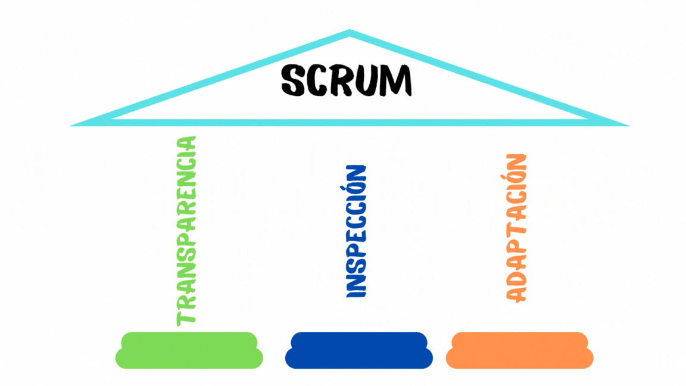

[Regresar](/CodingBootcampsESPOL-SCRUM/)

# Pilares empíricos de Scrum

Como ya se habia meniconado los eventos dentro de la metodología Scrum implemnetan los pilares empíricos de transparencia,
inspección y adaptación.

Transparencia
===========

* * *

El proceso y el trabajo emergentes deben ser visibles tanto para quienes realizan el trabajo como para quienes lo reciben. Con Scrum, las decisiones importantes se basan en el estado percibido de sus tres artefactos formales. Los artefactos que tienen poca transparencia pueden llevar a decisiones que disminuyan el valor y aumenten el riesgo.
La transparencia permite la inspección. La inspección sin transparencia es engañosa y derrochadora.

Inspección
===========

* * *

Los artefactos de Scrum y el progreso hacia los objetivos acordados deben inspeccionarse con frecuencia y con diligencia para detectar variaciones o problemas potencialmente indeseables. Para ayudar con la inspección, Scrum proporciona cadencia en forma de sus cinco eventos.
La inspección permite la adaptación. La inspección sin adaptación se considera inútil. Los eventos Scrum están diseñados para provocar cambios.

Adaptación
===========

* * *

Si algún aspecto de un proceso se desvía fuera de los límites aceptables o si el producto resultante es inaceptable, el proceso que se aplica o los materiales que se producen deben ajustarse. El ajuste debe realizarse lo antes posible para minimizar una mayor desviación.
La adaptación se vuelve más difícil cuando las personas involucradas no están empoderadas ni se autogestionan. Se espera que un Scrum Team se adapte en el momento en que aprenda algo nuevo a través de la inspección.

Referencias 
===========

* * *

* Sliger, M. (2011). Agile project management with Scrum. Paper presented at PMI® Global Congress 2011—North America, Dallas, TX. Newtown Square, PA: Project Management Institute.